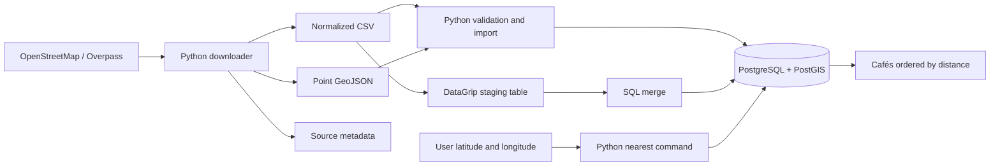

# Implementation document

## Objective and first release

Given a user's GPS latitude and longitude, return the closest mapped cafés in Cambodia
with names, coordinates, OSM identifiers, and distance in meters. Default to five results.
The project provides a CLI, data preparation, database schema, DataGrip workflow, and a
mobile web UI served by FastAPI. Phone location is acquired only after an explicit tap.
The UI posts coordinates to `/api/nearby` and reuses the existing PostGIS search.
See [PHONE.md](PHONE.md) for shared-Wi-Fi HTTPS and certificate trust setup.
Hosted road routing uses openrouteservice Matrix and Directions; see [ROUTING.md](ROUTING.md).
Leaflet draws café locations and selected routes with OpenStreetMap tiles. No local routing engine is required.

### Café location map

After a GPS, manual-coordinate, or Phnom Penh preview search, the UI displays a map
above the café list. A blue point marks the search location; numbered green markers
match the returned café cards. Tap a marker for its name and distance, jump to its
card, or request a route when routing is configured. Each card has **View on map**;
**Show all results** restores the overview after zooming or panning.

The map uses the `/api/nearby` response and shows the current page of search results,
not the entire Cambodia dataset. It works without an ORS key in straight-line mode.
Leaflet markers take `[latitude, longitude]`; GeoJSON route coordinates remain
`[longitude, latitude]`. New searches clear old markers and route selections.
Empty searches show only the search location. If tiles fail, markers and the list
remain available. Café coordinates are mapped points, not verified entrances.

Opening search results now loads OpenStreetMap tiles, even without requesting a
route. No extra Python dependencies, database migrations, or API keys are needed.
`tests/api/browser_map.cjs` checks map/list interaction, replacement of stale markers,
empty/error states, tile failure, and mobile layout with mocked API and tile data.

### Result pagination

Above the map heading, a café-name search and adjacent selector offer 10, 20, or
50 items per page. The name filter is applied in PostGIS before counting, paging,
and selecting up to 30 road candidates. It matches literal case-insensitive
substrings across name/name_en/name_km. Search and Clear reset to page one.
The list footer offers a result range (for example,
11–20 of 45), the current/total pages, and first/previous/next/last controls. Café
ranks continue across pages and map markers match those ranks. New location,
radius, travel-mode, or distance-mode searches reset to page one. Changing page
size also returns to page one. Moving pages closes the previous route selection.

`POST /api/nearby` accepts `page` (one-based, default 1) and `limit` (page size,
1–100 or `"all"`, default 10). Responses include `total`, `page`, `page_size`, and `total_pages`.
An empty result has `total_pages: 0`; an out-of-range page returns no cafés while
preserving the total. The UI disables unavailable navigation controls.

Straight-line mode uses one PostGIS statement to count matches within the radius
and fetch the requested page, sorted by distance, OSM type, and OSM ID. The count
and rows share a database snapshot. Separate page requests can reflect later imports.

Road mode keeps the existing 30-candidate limit. The UI requests the full ranked
set with `limit: 50, page: 1`, then pages those reachable results in memory. Page
navigation and page-size changes make no additional ORS calls. A new search
replaces this in-memory result set. This does not increase routing coverage beyond
the 30 checked candidates. Direct API road-page requests each rerun routing.

Validation: `tests/api/browser_pagination.cjs` uses mocked API/tile data to check
navigation, last-page boundaries, page-size/filter resets, global marker ranks,
road-result reuse, empty results, and mobile/desktop layouts. API tests verify
pagination metadata and validation; integration tests verify real PostGIS ordering,
counts, radius filtering, and empty/out-of-range pages in a disposable test database.

## Architecture

The FastAPI runtime now uses the root-level `app/` structure documented in
[PROJECT_STRUCTURE.md](PROJECT_STRUCTURE.md): `api/v1` validates requests and calls
`services`, which use repository/routing contracts. `repositories` owns PostGIS SQL,
`services` handles external providers, and `gis` holds coordinate/data helpers.
The browser uses `/api/v1`; old `/api` endpoints remain compatibility aliases.
The database schema and phone HTTPS setup are unchanged. Reserved GIS modules
have no endpoints or data tables yet.

Python handles network requests, file formats, validation, and output. PostGIS handles
spatial storage, radius filtering, and straight-line distances. Hosted openrouteservice
supplies road distances, estimated durations, and route geometry. DataGrip is an alternative
database client for the same schema, not a runtime dependency.

Psycopg is sufficient for this scope; GeoPandas is not necessary for point imports.
Add GIS transformation tooling when polygon processing or more advanced analysis is needed.

## Data contract

| Field | Type | Meaning |
| --- | --- | --- |
| `osm_type` | text | `node`, `way`, or `relation` |
| `osm_id` | positive bigint | OSM identifier; unique only together with its type |
| `name` | text | Original OSM `name` |
| `name_en` | text | Optional `name:en` |
| `name_km` | text | Optional `name:km`; preserve UTF-8 |
| `latitude` | finite number | WGS84 latitude, -90 through 90 |
| `longitude` | finite number | WGS84 longitude, -180 through 180 |

The CSV has all seven named columns. Missing names are empty strings, not grounds to
discard a café. Coordinates and identifiers are mandatory. GeoJSON uses the same
identifier/name properties and obtains coordinates from `geometry.coordinates` in
`[longitude, latitude]` order. Only two-dimensional WGS84 Points are accepted.

The downloader queries `amenity=cafe`, including nodes, ways, and relations. OSM
`shop=coffee` is not included because it describes coffee retail rather than necessarily
a café. No shop names, ratings, opening hours, or business status are fabricated.

`metadata.json` records the query, endpoint, download timestamp, OSM base timestamp
when supplied, record count, attribution, license link, and coordinate approximation.
Store this file alongside exports to preserve provenance. The database's `imported_at`
is an ingestion time, not the date a business was last checked.

## Storage and imports

`coffee_shops` is the application table. Its generated `geography(Point, 4326)` column
stays consistent with numeric coordinates. A GiST index supports radius filtering.
Constraints enforce the OSM type, positive ID, and coordinate bounds.

`coffee_shop_import` is a staging table for DataGrip's CSV importer. It contains only
the seven input columns, allowing a user to inspect and commit imported rows before
merging them into the application table.

Python validates an entire input file before opening the import transaction. Exact
duplicate records collapse. Conflicting values for the same OSM identity cause an
error. All database writes for one file commit together or roll back together.

Both import paths use `ON CONFLICT (osm_type, osm_id) DO UPDATE`. Reimporting a dataset
does not multiply objects. It updates names and coordinates and refreshes `imported_at`.
Missing records are retained: upsert is not a full snapshot synchronization strategy.

DataGrip's CSV upload and subsequent merge are two separate stages. Review the upload
for errors before merging; otherwise only the successfully uploaded staging rows could
be merged. The merge itself is transactional. See [DATAGRIP.md](DATAGRIP.md).

`001_schema.sql` initializes this version and may be rerun. It is not a migration
framework and does not alter incompatible pre-existing tables. Use an empty project
database; introduce versioned migrations before making future schema changes.

## PostGIS and CLI nearest-search behavior

1. Validate finite latitude/longitude, a result limit from 1 to 100, and an optional
   finite positive radius.
2. Build the user point with `ST_MakePoint(longitude, latitude)` and cast to geography.
3. When a radius is supplied, filter with `ST_DWithin(..., radius_m)`.
4. Calculate `ST_Distance` to each candidate and sort ascending, with OSM type/ID
   as a deterministic tie-breaker. Apply the limit after sorting.
5. Display the original name, then Khmer or English fallback, then `Unnamed café`.

`geography` uses meter-based distances on the spheroid by default. Results are distances
between mapped points, not road network distances or travel times. A radius query may
return fewer than five results; an unrestricted query returns up to five across the
whole imported table. There is no implicit radius expansion.

For this small starter, unrestricted search calculates exact distances for all rows.
At larger scale, profile real data and consider an index-assisted nearest-neighbor
strategy. Geography KNN ordering uses spherical distances, so do not assume it is
identical to exact spheroidal `ST_Distance` ordering without considering that tradeoff.

SQL values are bound through Psycopg parameters. Coordinates never become SQL text.
The only conditional SQL fragment is a fixed radius-filter clause owned by the app.

The web UI can separately request road mode: PostGIS supplies up to 30 candidates,
hosted openrouteservice ranks their route distances, and a selected café gets a detailed
route map and instructions. The API's road fields are distinct from the straight-line
fields. See [ROUTING.md](ROUTING.md) for shortlist limitations and failure handling.

## Failure handling and operation

- Overpass uses one request per explicit download, not one request per user search.
  Requests have connection/read timeouts. HTTP errors and Overpass `remark` errors
  abort the export; partial responses are not accepted as complete datasets.
- Build files in a temporary directory before replacing each export. Existing files
  require explicit `--overwrite`. Individual file replacements are atomic, but the
  three-file export is not a filesystem-wide transaction.
- Invalid files and database/network failures produce a nonzero CLI exit status.
  No results is a successful search and produces `[]` in JSON mode.
- Keep database credentials in `.env` or the environment. `.env` and generated data
  are excluded from Git. Local Compose binds its port to localhost.
- There is no background scheduler in this release. Refresh explicitly and retain
  download metadata. Review removals and closures manually until reconciliation exists.

## Implementation phases and acceptance criteria

| Phase | Delivered files | Acceptance |
| --- | --- | --- |
| Local setup | `pyproject.toml`, `.env.example`, `docker-compose.yml` | CLI installs; local PostGIS becomes healthy |
| Data preparation | `app/gis/geojson.py`, `app/services/location_service.py` | CSV and GeoJSON round-trip Khmer names and coordinates; partial/error responses fail |
| Database | `001_schema.sql`, `app/repositories/place_repository.py`, `upsert.sql` | Schema initializes twice; repeat import preserves row count; coordinate changes update geography |
| DataGrip workflow | `DATAGRIP.md`, `002_import_staging.sql` | Seven CSV columns map cleanly; staging merge updates existing IDs |
| Search | `scripts/cli.py`, `app/repositories/place_repository.py`, `003_nearest_example.sql` | Meter distances sort correctly; radius exclusions and no-result cases behave correctly |
| Hosted routes | `app/services/`, `app/services/`, `app/api/`, `app/static/` | Route distances rerank candidates; selected geometry and steps render; missing keys/errors never masquerade as road results |
| Verification | `tests/` | Unit tests pass; integration tests pass against a disposable PostGIS database |

Unit tests use deterministic synthetic inputs and mocked HTTP responses. Integration
tests exercise real spatial SQL in a temporary database. Live data coverage and actual
business freshness require a separate manual review; test fixtures do not establish them.

## Next extensions

1. Add authentication and deployment configuration if public internet access is needed.
2. Add continuous navigation if needed; embedded route maps and street instructions are implemented.
3. Add closure/removal reconciliation, per-object provenance, and a refresh history.
4. Review possible duplicate real-world shops across different OSM objects.
5. Improve nearest-by-road candidate selection beyond the current 30-café shortlist.

## Technical references

- [Overpass QL, including center output](https://wiki.openstreetmap.org/wiki/Overpass_API/Overpass_QL)
- [OSM café category](https://wiki.openstreetmap.org/wiki/Tag:amenity%3Dcafe)
- [OSM coffee retail category](https://wiki.openstreetmap.org/wiki/Tag:shop%3Dcoffee)
- [ST_MakePoint coordinate order](https://postgis.net/docs/ST_MakePoint.html)
- [ST_DWithin and index usage](https://postgis.net/docs/ST_DWithin.html)
- [ST_Distance measurement behavior](https://postgis.net/docs/ST_Distance.html)
- [Psycopg parameterized queries and transactions](https://www.psycopg.org/psycopg3/docs/basic/usage.html)

### Show all results

The page-size selector supports 10, 20, 50, 100 and All. `limit: "all"` requests
all matching cafés in straight-line mode, preserving radius/name filters and
returning a single page. Road mode still uses its existing maximum of 30 candidates;
All shows the full reachable shortlist without another routing call. Switching
page size resets to page one. All can render many markers and cards at once.
